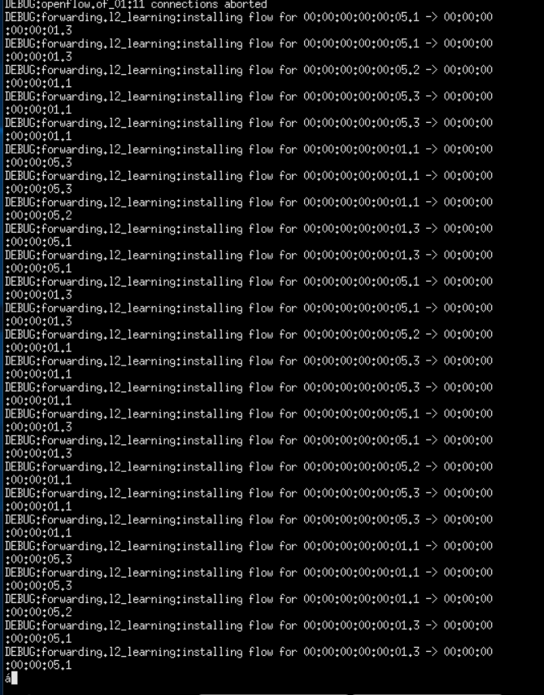
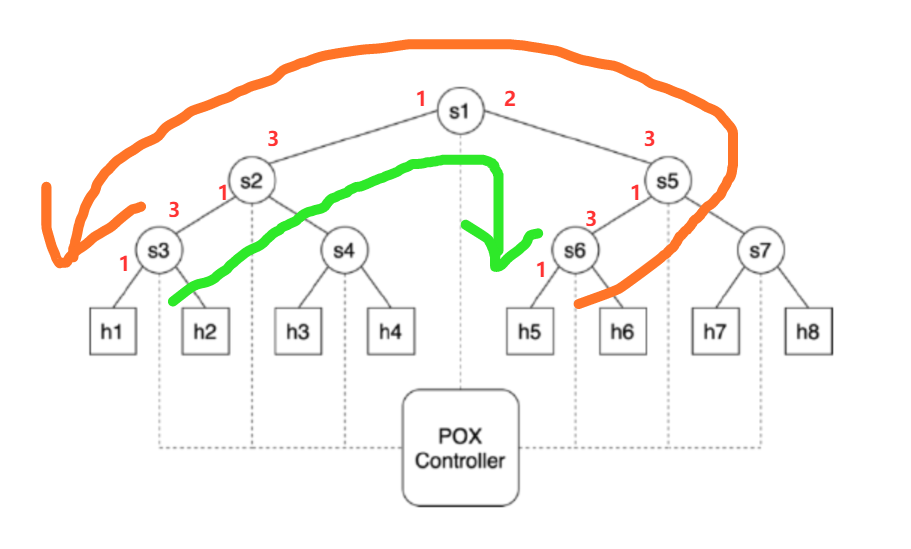
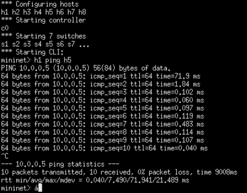
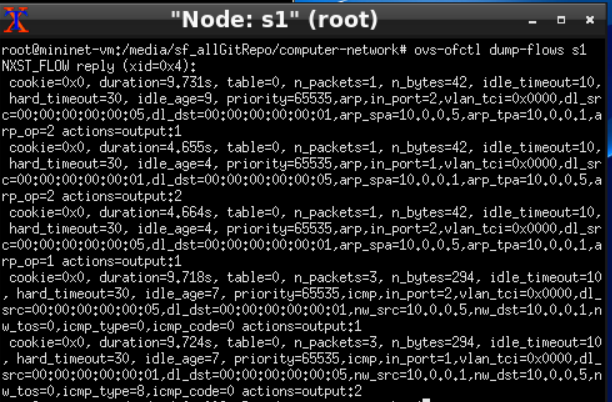
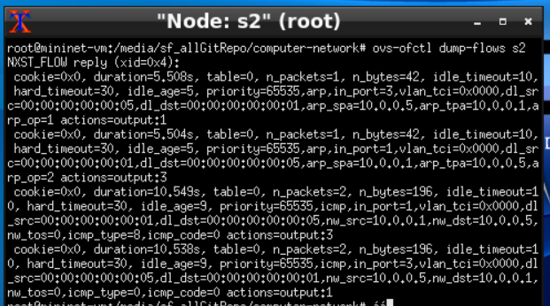
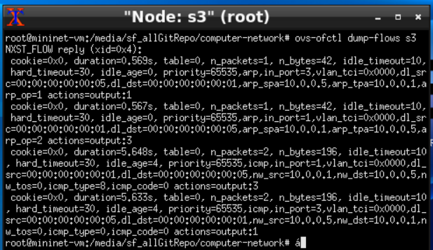
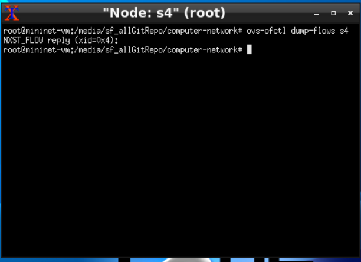
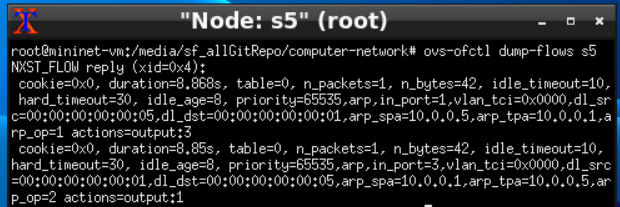
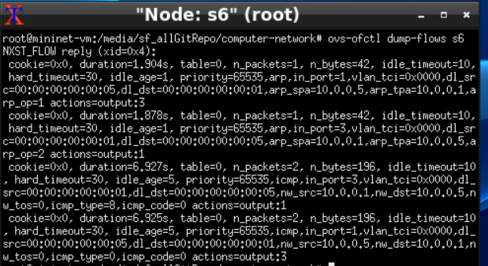
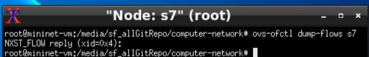

# CS656 End of Assessment Part C

* Question 1

In this question, when I execute ```h1 ping h5```, the output of POX program is as follows:



For example, ```DEBUG:forwarding.l2_learning:installing flow for 00:00:00:00:00:05.1 -> 00:00:00:00:00:01.3```, it means, this packet source is ```00:00:00:00:00:05``` (host 5's MAC address, since we use ```--mac``` command), the following ```1``` means that the number of port the packet came in on port 1.
And the packet destination is ```00:00:00:00:00:01``` (host 1's MAC address), and the following ```3``` means it will go to the port 3.

When we go through all the DEBUG information, we can know what controller do to get this routing path. The orange line is the first part (packet from host 5 to host 1). The green line is the second part (packet from host 1 to host 5).



* Question 2

In this question, we can see the picture below is the ping RTT times for the first 10 ping messages. The first message takes a longer time than all the other messages. I think it is because it is the first time to build the connection between host 1 and host 5. It will take some time to figure out the routing path for POX controller. After that, all the following packets between h1 and h5 will follow the same path, so the other packets take less time.





* Question 3

When I dump the flow rules on all the switches, for example, enter the command ```ovs-ofctl sump-flows s1```, the output are as follows:









As we can see, since we enter ```h1 ping h5``` in mininet shell, the controller will  connect the neccessary switches and the corresponding flow table entries have been installed as well. In this example, the path is 

```h1 <--> s3 (1) <--> s3(3) <--> s2(1) <--> s2(3) <--> s1(1) <--> s1(2) <--> s5(3) <--> s5(1) <--> s6(3) <--> s6(1) <--> h5```

We can see s1, s2, s3, s5, s6 have flow table entries. s4 and s7 have empty flow table entries.